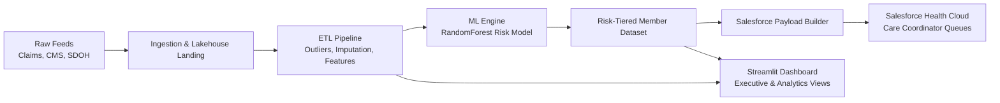

---

### 🧩 `architecture_diagram.md` (for leadership decks)

````markdown
# Architecture Diagram (Conceptual)


```mermaid
flowchart LR
    A[Raw Feeds<br/>Claims, CMS, SDOH] --> B[Ingestion & Lakehouse Landing]
    B --> C[ETL Pipeline<br/>Outliers, Imputation, Features]
    C --> D[ML Engine<br/>RandomForest Risk Model]
    D --> E[Risk-Tiered Member Dataset]
    E --> F[Salesforce Payload Builder]
    F --> G[Salesforce Health Cloud<br/>Care Coordinator Queues]

    E --> H[Streamlit Dashboard<br/>Executive & Analytics Views]
    C --> H
```
````
